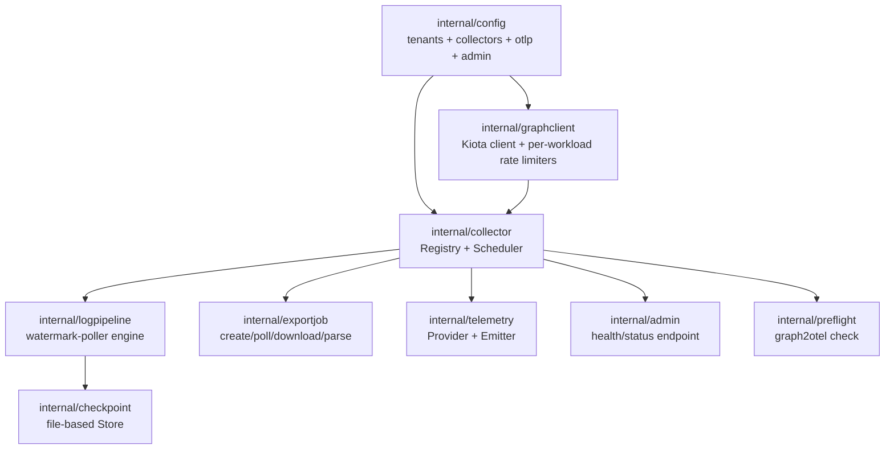

# Architecture

`graph2otel`'s closest architectural analogs are `sf2loki`'s Source/Sink/CheckpointStore
composition pattern (poll a tenant-scoped SaaS API, single global instance, avoid
over-building HA prematurely) and `tailscale2otel`'s poll → `telemetry.Emitter` facade.
This page walks the seams the composition root wires together.

## The pieces

### Multi-tenant config (`internal/config`)

A `Config` document with a `tenants` list (each entry a tenant ID + client ID + optional
per-collector overrides), a global `collectors` map, `otlp`, `admin`, and
`checkpoint_dir`. Layered load order: built-in defaults → optional YAML file →
`G2O_*` environment variables (env always wins). Auth material never appears in this
layer at all — it comes from environment variables consumed directly by
`azidentity.DefaultAzureCredential`. See [Configuration](configuration.md) for the full
key reference.

### Graph client factory (`internal/graphclient`)

Wraps `msgraph-sdk-go` v1.0, re-attaching Kiota's default middlewares (retry, redirect,
compression, telemetry) explicitly under graph2otel's own OTEL-instrumented transport.
Every outbound request is classified into a `Workload` — `reporting` (sign-in/audit/
provisioning log endpoints, 5 req/10s per app per tenant), `identity-protection`
(Identity Protection + Conditional Access, 1 req/s per tenant across all apps — the
tightest ceiling Graph exposes), `directory` (plain directory-object reads, which do send
`Retry-After` and so lean more on Kiota's built-in retry), Intune's general/elevated
Devices tiers, and Intune's reports-export ceiling (48 req/min per app) — before a
client-side rate limiter paces it. None of the reporting or Identity Protection
workloads reliably send `Retry-After`, so this client-side pacing is the only thing
keeping graph2otel inside Graph's throttle budget; Kiota's own retry logic is not enough
on its own.

### Collector framework (`internal/collector`)

Ported from `tailscale2otel`. Two collector shapes:

- **`SnapshotCollector`** — fetches current state each tick (directory objects, device
  compliance, license SKUs, and other inventory-shaped data) and emits it as OTEL metric
  gauges/counters.
- **`WindowCollector`** — polls an event stream (sign-ins, directory audits, provisioning,
  risk detections, Intune audit events) for a checkpointed time window and emits each
  record as an OTEL log. Watermark, overlap window, and seen-ID dedupe all live in the
  shared `internal/logpipeline` engine (below) — a real `WindowCollector` implementation
  is a thin `EndpointConfig` plus a `Map` function, not a hand-rolled poller.

A `Registry` holds every enabled collector; a goroutine-per-collector `Scheduler` drives
each on its own ticker, staggered so a large collector set doesn't all fire in the same
instant. Every collector run reports self-observability (`graph2otel.scrape.*`) through
the same `telemetry.Emitter` collectors use for domain data.

### Log-stream engine (`internal/logpipeline`)

None of `signIns`, `directoryAudits`, `provisioning`, `riskDetections`, `riskyUsers`, or
Intune `auditEvents` support a delta query or a reliable server-side cursor, so this
package owns, once, the mechanics every one of those endpoints would otherwise hand-roll:
build a time-window `$filter`, follow `@odata.nextLink` to exhaustion, dedupe by
immutable ID against the checkpoint's overlap window, emit each record as an OTLP log,
and advance the watermark. Streams that share a Graph path (the four sign-in event
types all poll `/auditLogs/signIns`) get distinct `CheckpointKey`s so they don't collide
on one checkpoint namespace and dedupe each other's events away.

### Export-job subsystem (`internal/exportjob`)

Most fleet-wide Intune report data (app install status, feature-update device states,
enrollment failures, certificate inventory, Defender agent health, …) is only available
through the async **reports export API**, not a paged entity walk — per-device entity
walks would blow the throttling budget on a large fleet. `exportjob` implements the
generic create → poll → download → unzip → parse flow every export-based report
collector builds on: `POST .../reports/exportJobs` to create a job, poll with exponential
backoff to a terminal status, download the pre-signed SAS-url ZIP before it expires, and
parse its single CSV/JSON entry into rows. The whole flow shares one 48-req/min-per-app
rate budget — every poll counts against it, which is why backoff matters more here than
on a typical paged endpoint.

### Telemetry emitter facade (`internal/telemetry`)

The only package touching OTLP metrics + logs directly, so exporter details never leak
into collectors. `Provider` builds the OTEL SDK metric/log pipelines for the configured
protocol (`grpc` / `http` / `stdout`); `Emitter` is the narrow interface collectors call
against (gauges, counters, histograms, log records). Grafana Cloud's auth header and the
`/v1/metrics` vs `/v1/logs` URL-path distinction live here, once. A `CardinalityTracker`
backs the `graph2otel.series.*` self-observability metrics.

### Checkpointing (`internal/checkpoint`) {#checkpointing}

A file-based `Store` rooted at `checkpoint_dir`, with one JSON file per
`(tenant_id, endpoint)` pair, storing `{watermark, overlap_window, seen_ids}`. Safe for
concurrent use by multiple `WindowCollector`s polling different endpoints on their own
goroutines. On restart, a collector resumes from `watermark - overlap` rather than
re-fetching everything or silently dropping events that arrived out of order.

### Operator surfaces

- **`internal/admin`** — an optional (`admin.enabled`) HTTP endpoint: an unconditional
  `/healthz` liveness probe plus a per-tenant, per-collector status page served as both
  HTML (`/`) and JSON (`/api/status.json`) from one shared data model. It's single-instance
  ops visibility, not a control plane — no mutating endpoints, and every request renders a
  fresh snapshot of the scheduler's own recorded state rather than keeping a separate copy.
- **`internal/preflight`** — backs the `graph2otel check` subcommand: validates, ahead of
  time, that every enabled collector's declared Microsoft Graph application permissions
  are both granted on the app registration and admin-consented, so a missing scope is
  reported once up front instead of surfacing later as a runtime 403.

## Single-instance, no HA in v1

None of the Graph endpoints graph2otel polls support consumer-group or delta semantics
that would make multi-replica coordination (leader election, work partitioning) pay for
itself — every poller already has to re-derive its own watermark regardless of how many
replicas exist, so adding replicas would mean either duplicate polling or a coordination
layer with no endpoint feature to hang it off. graph2otel therefore runs as a single
instance per configured tenant set; this is a deliberate v1 scope decision, revisited
only if a real multi-replica requirement shows up (e.g. an operator needing to shard an
extremely large tenant count across processes).
