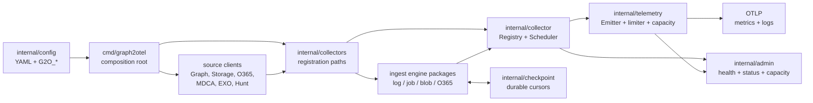

# Architecture

`graph2otel` is one multi-tenant process that polls several Microsoft control
planes and pushes metrics and logs over OTLP. The composition root in
`cmd/graph2otel` owns credentials, clients, collector construction, scheduling,
and shutdown. Collectors depend on narrow interfaces and hand signals to
`internal/telemetry`; they do not construct SDK providers or exporters.

## Data flow


```mermaid
flowchart LR
    cfg["internal/config<br/>YAML + G2O_*"]
    root["cmd/graph2otel<br/>composition root"]
    clients["source clients<br/>Graph, Storage, O365,<br/>MDCA, EXO, Hunt"]
    factories["internal/collectors<br/>registration paths"]
    engines["ingest engine packages<br/>log / job / blob / O365"]
    scheduler["internal/collector<br/>Registry + Scheduler"]
    emitter["internal/telemetry<br/>Emitter + limiter + capacity"]
    otlp["OTLP<br/>metrics + logs"]
    checkpoint["internal/checkpoint<br/>durable cursors"]
    admin["internal/admin<br/>health + status + capacity"]

    cfg --> root
    root --> clients
    root --> factories
    clients --> factories
    factories --> engines
    factories --> scheduler
    engines --> scheduler
    engines <--> checkpoint
    scheduler --> emitter
    emitter --> otlp
    scheduler --> admin
    emitter --> admin
```

The diagram separates two concepts that are easy to conflate:

- a **registration path** is how the composition root constructs a collector
  with the dependencies for its source;
- an **ingest engine** is shared cursor and delivery machinery for one transport
  shape.

Some registration paths return a collector that uses an ingest engine. Others
return a direct snapshot or window collector over a source-specific client.

## Configuration and composition

`internal/config` loads built-in defaults, optional YAML, then `G2O_*`
environment overrides. The resulting config describes tenants, collector
selection, checkpoint storage, OTLP, cardinality, capacity-cost metadata,
profiling, and the admin server. Authentication material is not accepted in
YAML: Azure credentials come from `azidentity.DefaultAzureCredential`, while
source-specific secrets such as the MDCA token are read through their explicit
secret-file settings.

For each tenant, `cmd/graph2otel` builds the enabled source clients, walks every
collector registration path, applies config/license/experimental/high-volume
gates, registers the resulting collectors, and starts one tenant-scoped
`internal/collector.Scheduler`. Source clients and rate limiters are shared
within that tenant where their transport permits it.

## Graph transport

Collectors use **Raw REST** through `internal/graphclient`. Its narrow
`RawGet`/`RawGetWithHeaders` surface keeps wire decoding in each collector,
while its OTEL-instrumented HTTP transport, workload classification,
client-side rate limiting, retry, paging helpers, and beta opt-in are shared.
This is deliberately not a typed-SDK collector architecture.

There is exactly one `msgraph-sdk-go` call site:
`internal/license/graphclient_adapter.go`, which adapts the SDK
`subscribedSkus` request for license detection. It is an isolated compatibility
adapter, not a collector transport. New collectors must use
`internal/graphclient`.

## Collector framework and census

`internal/collector` defines the two scheduling contracts:

- `SnapshotCollector` answers "what is true now?" on each tick. It is used for
  state-shaped gauges/log twins and also for source engines whose cursor is not
  a time window, such as Azure Storage byte offsets.
- `WindowCollector` consumes a bounded `[from, to]` interval. It is used for
  event streams with a durable watermark and for source-specific streams that
  can honor the same scheduling contract.

Factories self-register under `internal/collectors`; the composition root
constructs them once per eligible tenant. There are **7 registration paths**:

| path | registry seam | scheduled shape | source |
| --- | --- | --- | --- |
| Snapshot | `Deps` / `All` | `SnapshotCollector` | Graph Raw REST, plus the shared Intune report-export runner where required |
| Window | `WindowDeps` / `WindowAll` | `WindowCollector` | Graph page polling, Graph async audit-query jobs, or an EXO window client |
| Blob | `BlobDeps` / `RegisterBlob` | `SnapshotCollector` | Azure Storage diagnostic blobs |
| O365 | `O365Deps` / `O365All` | `WindowCollector` | O365 Management Activity API |
| MDCA | `MDCADeps` / `RegisterMDCA` | `WindowCollector` | Defender for Cloud Apps portal API |
| EXO | `EXODeps` / `RegisterEXO` | `SnapshotCollector` | Exchange Online admin API |
| Hunt | `HuntDeps` / `RegisterHunt` / `HuntAll` | `SnapshotCollector` | Microsoft Defender XDR advanced-hunting query API |

The current registry contains **155 registration-path candidates** representing
**152 logical collectors**. The difference is intentional: a logical signal can
have more than one mutually exclusive source candidate. `internal/collectordoc`
walks every path and the generated collector reference is drift-gated. An
eighth path is incomplete unless the census, `collectordoc.Rows` signature, and
all generated gates are extended in the same change.

`Registry` holds the enabled instances. `Scheduler` gives each collector its own
goroutine and interval, with a small startup stagger so a large tenant does not
burst every source at once. A failed collector is isolated from its peers.

## Ingest engine shapes

There are **4 ingest engine shapes**. They share scheduling and telemetry
seams but retain transport-specific cursor rules:

### `internal/logpipeline`

This is the paged Graph event-log engine. It builds the time filter, follows
`@odata.nextLink`, maps records, and maintains a watermark plus overlap and
seen-ID dedupe. Graph exposes no delta cursor for these endpoints. Streams that
share a path, including the four sign-in variants, therefore use distinct
checkpoint keys.

### `internal/jobpipeline`

This is the asynchronous Graph audit-query engine. It submits a query, polls it
to completion, pages results, maps and dedupes records, then advances the
window. The in-flight query ID and its exact window are persisted so a restart
adopts the same job instead of creating a duplicate or moving the watermark
past an undrained range.

`internal/exportjob` shares the create/poll/download/unzip/parse mechanics used
by Intune reports-export snapshot collectors. It is part of the async-job
transport family but is not a fifth scheduling engine: those collectors still
enter through the Snapshot registration path and emit from the collector.

### `internal/blobpipeline`

This is the Azure Storage diagnostic-log engine. Its cursor is a byte offset per
blob, not a time watermark. It lists blobs, resumes each object at its durable
offset, decodes complete records, and saves progress without retaining blob
contents in memory. Azure diagnostic delivery is itself at-least-once, so
source duplicates are intentionally preserved; downstream dedupe uses the
stable record identity documented in [Blob ingest](blob-ingest.md).

### `internal/o365pipeline`

This is the O365 Management Activity API engine. That API first lists content
blobs, then downloads each blob to obtain records. The engine therefore tracks
a content-created watermark and separate namespaces for seen content IDs and
seen record IDs. It starts and maintains configured subscriptions through
`internal/o365activityclient`, chunks the API's bounded time ranges, and will
not advance past a content blob that failed to download.

MDCA, Exchange Online, and advanced hunting retain their own clients because
their authentication, request, and response shapes are not any of the four
engines above. They still return the standard Snapshot or Window contract, so
the scheduler and telemetry boundary remain shared.

## Checkpoints and delivery semantics

`internal/checkpoint.Store` is a file-backed, concurrent store with one
atomically replaced JSON document per tenant and checkpoint namespace. Startup
verifies that `checkpoint_dir` is writable; an unwritable store is fatal because
silently restarting from the initial lookback would create an unbounded replay.
A persistent volume is therefore part of the deployment contract.

The engines encode different cursor state in that shared store:

- log and job pipelines persist a watermark, overlap, and seen IDs;
- job pipelines also persist an in-flight query and its original window;
- blob pipelines persist byte offsets per blob;
- O365 pipelines persist the content watermark plus content/record identities.

Checkpoint state advances only through data the engine has consumed. A source
or page failure leaves the undrained range replayable. The practical contract is
at-least-once: a crash after a signal is accepted locally but before its
checkpoint is durable can replay the signal. Overlap and seen-ID state suppress
the common API-window replay for engines with stable IDs, while Azure's own
duplicate blob records remain visible by design. Checkpoints prevent silent
gaps; they are not a global exactly-once transaction with the OTLP backend.

## Scheduler outcomes

Every run receives a concurrency-safe `internal/recordoutcome.Recorder`.
Collectors and engines account for source records as:

```text
fetched = mapped + filtered + dropped + errored
mapped  = emitted + deduped
```

The scheduler snapshots that recorder once, derives `empty`, `success`,
`partial`, or `failure`, and publishes bounded scrape/outcome telemetry and the
admin status update from the same immutable summary. Mapping failures remain
visible without hiding successfully emitted prefixes; shutdown cancellation is
not misreported as a source failure.

The same completed-run snapshot records exact logical source volume for
capacity accounting. A persisted cold-start target keeps
`cold_start_backfill` attribution active across multiple slices and restarts
until the original backfill target is reached; normal recurring runs are
`steady_state`.

## Telemetry, cardinality, and capacity

`internal/telemetry.Provider` is the only owner of the OpenTelemetry metric and
log SDKs. It builds the configured HTTP, gRPC, or stdout exporters and exposes a
narrow `Emitter` facade for gauges, counters, histograms, and log events.
Tenant ID and ingest transport are stamped at this boundary rather than by
collectors.

Collector emitters are attributed by tenant, collector, transport, and traffic
class. Their data passes through the central `Limiter` before the SDK:

- per-metric and global series limits are enforced in one place;
- significant additive tails fold into an explicit `other` bucket;
- non-additive tails are dropped rather than fabricated;
- limiter losses and active-series counts are self-observed.

The limiter does not make entity-shaped metric labels acceptable. Metrics still
carry bounded aggregates and logs carry per-entity detail.

Capacity accounting sits beside the emission path rather than in a collector:

- `VolumeTracker` counts exact source records and post-limiter emitted metric
  and log points for each bounded attribution;
- exporter observers count exact post-compression OTLP payload bytes and
  internal retry attempts by signal;
- optional cost projection allocates signal-specific payload bytes across
  emitted points using operator-supplied rates and provenance.

Cost is observational only. It does not feed the scheduler, source clients,
limiter, exporter, or any enforcement path. The provider publishes bounded
`graph2otel.ingest.*` and `graph2otel.otlp.*` self-observability; the admin
surface reads the same cumulative in-process snapshots for rolling capacity
views.

## Operator surfaces

- `internal/admin` serves process liveness, latched readiness, and
  per-tenant/per-collector status as HTML and JSON. Its capacity view is derived
  from scheduler/provider state, not a second accounting pipeline. It has no
  mutating control endpoint.
- `internal/preflight` backs `graph2otel check`, comparing enabled collectors'
  declared Graph application permissions with the current app grants and admin
  consent.
- `internal/profiling` optionally pushes continuous profiles to Pyroscope. It
  does not expose a local `pprof` endpoint.

## Single instance

graph2otel deliberately runs as a **single instance** for one configured tenant
set. There is no leader election, consumer group, or shared transactional
checkpoint protocol. Running replicas against the same sources would duplicate
polling and race file-backed cursors. Scale a deployment by assigning disjoint
tenant sets to separate processes; do not run active-active replicas over the
same set.
